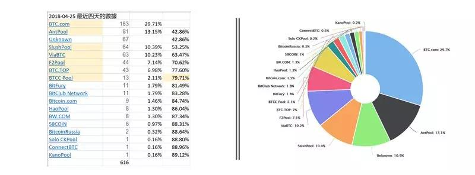
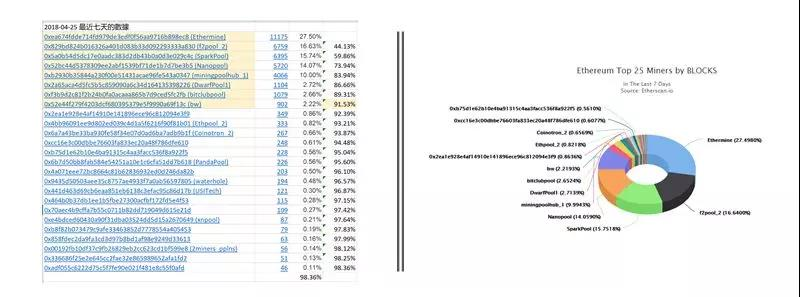
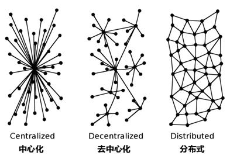

## 传统 DPoS
EOS 项目刚刚发布的时候的共识机制是 DPoS(委托股权证明)，类似于 Bitshares 和 Steem，这种共识机制采用随机的见证人出块顺序，出块速度为 3 秒，交易不可逆需要45秒。为什么需要 45 秒呢？因为 DPoS 下，见证人生产一个新区块，才表示他对之前的整条区块链进行了确认，表明这个见证人认可目前的整条链。而一个交易要达到不可逆状态，需要 2/3 以上的见证人确认，在 EOS 里就是 14 个见证人。我们假设一个交易被包含在 1000 号区块中，需要其他13个见证人轮流出块至 1013 号区块，这样才能“收集”到14个见证人对此交易的确认（包括生产1000区块的见证人）。2/3 以上的见证人确认的交易，就是不可逆的交易了，这就是 45 秒确认时间的由来

## BFT算法
为了改进传统的 DPoS 算法，我们可以借鉴 PBFT（拜占庭容错算法）的机制。在传统 DPoS 共识机制中，我们让每个见证人在出块时向全网广播这个区块，但即使其他见证人收到了目前的新区块，也无法对新区块进行确认，需要等待轮到自己出块时，才能通过生产区块来确认之前的区块。

在新的机制下，每个见证人出块时依然全网广播，其他见证人收到新区块后，立即对此区块进行验证，并将验证签名完成的区块立即返回出块见证人，不需等待其他见证人自己出块时再确认。从当前的出块见证人看来，他生产了一个区块，并全网广播，然后陆续收到了其他见证人对此区块的确认，在收到 2/3 见证人确认的瞬间，区块（包括其中的交易）就不可逆了。交易确认时间大大缩短，从 45 秒缩短至 3 秒左右（主要为等待生产区块的时间）。这种机制可以称为初级版的 BFT-DPoS 共识机制

## BFT-DPoS算法
为了挖掘 EOS 系统的性能，Daniel Larimer(也就是BM) 在以上基础上又进行了修改。首先，他将出块速度由 3 秒 缩短至 0.5 秒，理论上这样可以极大提升系统性能，但带来了网络延迟问题：0.5 秒的确认时间会导致下一个出块者还没有收到上一个出块者的区块，就该生产下一个区块了，那么下一个出块者会忽略上一个区块，导致区块链分叉（相同区块高度有两个区块）。比如：中国见证人后面可能就是美国见证人，中美网络延迟有时高达 300ms，很有可能到时美国见证人没有收到中国见证人的区块时，就该出块了，那么中国见证人的区块就会被略过。

为解决这个问题，Daniel Larimer 将原先的随机出块顺序改为由见证人商议后确定的出块顺序，这样网络连接延迟较低的见证人之间就可以相邻出块。比如：日本的见证人后面是中国的见证人，再后面是俄罗斯的见证人，再后面是英国的见证人，再后面是美国的见证人。这样可以大大降低见证人之间的网络延迟。使得 0.5 秒的出块速度有了理论上的可能。

为了保证万无一失，不让任何一个见证人因为网络延迟的意外而被跳过，Daniel Larimer 让每个见证人连续生产 6 个区块，也就是每个见证人还是负责 3 秒的区块生产，但是由最初的只生产 1 个变成生产 6 个。最恶劣的情况下，6 个区块中，最后一个或两个有可能因为网络延迟或其他意外被下一个见证人略过，但 6 个区块中的前几个会有足够的时间传递给下一个见证人。

再来讨论 BFT-DPoS 的交易确认时间问题：每个区块生产后立即进行全网广播，区块生产者一边等待 0.5 秒生产下一个区块，同时会接收其他见证人对于上一个区块的确认结果。新区块的生产和旧区块确认的接收同时进行。大部分的情况下，交易会在 1 秒之内确认（不可逆）。这其中包括了 0.5 秒的区块生产，和要求其他见证人确认的时间。

EOS 系统规定，一旦区块达到不可逆状态（2/3见证人确认），就无法在此之前进行分叉，保证了交易的永久可信。另外，即使多数见证人想分叉区块链，也只能以相同的速度（0.5秒）与主链竞争，就算主链只剩下一个见证人，分叉链也永远不会追上主链，保证了系统的稳定。