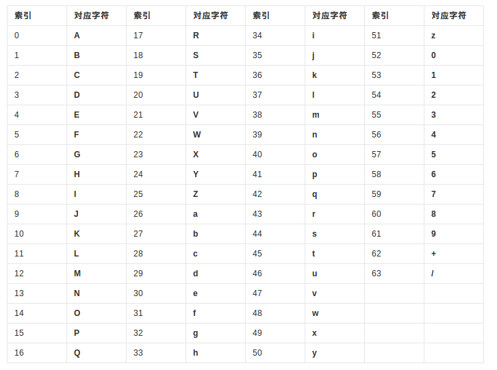

# base256编码

使用8个二进制比特位表示一个字符，得到base256编码。将最高为固定为0，即得到我们熟悉的ASCII编码。ASCII的编码表如下图所示：


# base64编码

## 目的

某些系统中只能使用ASCII字符。Base64就是用来将非ASCII字符的数据转换成ASCII字符的一种方法。

## 编码过程

1. 转化为ASCII编码

s 1 3 转化为 115 49 51

2. 转化为二进制编码

01110011 00110001 00110011

3. 6个一组

011100 110011 000100 110011

4. 每一组前面补两个0

5. 按照如下的对应表编码 10+26+26+2 = 64
  


# base58 编码

## 目的，中本聪在base58.h中提到的

设计Base58主要的目的是：
1. 避免混淆。在某些字体下，数字0和字母大写O，以及字母大写I和字母小写l会非常相似。
2. 不使用"+"和"/"的原因是非字母或数字的字符串作为帐号较难被接受。
3. 不使用标点符号的原因是，这样通常不会被从中间分行。
4. 大部分的软件支持双击选择整个字符串。

## 编码过程

由于256不能被58整除，Base58无法像Base64那样转换为8bits的2进制后依次取出6bits就可以快速完成转换。因此，Base58编码算法需要除法运算实现，如果被编码的数据较长，则要用特殊的类来处理大数，在Bitcoin使用了OpenSSL中的BIGNUM。

```c plus plus
// 比特币定义的字母表，其他的币有不同的定义
code_string = "123456789ABCDEFGHJKLMNPQRSTUVWXYZabcdefghijkmnopqrstuvwxyz"

// 将byte数组转化为一个整数
x = convert_bytes_to_big_integer(hash_result)

//最后输出的结果
output_string = ""

// 不断地求余数
while(x > 0) {
	(x, remainder) = divide(x, 58)
	output_string.append(code_string[remainder])
}

// 前导0的个数
repeat(number_of_leading_zero_bytes_in_hash){
	// 0编码之后是1
	output_string.append(code_string[0]);
}

// 将大端序改为小端序
output_string.reverse();
```

bitcoin中的base58编码表如下：


## 在线验证
http://lenschulwitz.com/base58

## 代码实现

### perl实现
http://lenschulwitz.com/b58/base58perl.txt

### bitcoin实现   

bitcoin/src/base58.h
```c plus plus
// Copyright (c) 2009-2010 Satoshi Nakamoto
// Copyright (c) 2009-2017 The Bitcoin Core developers
// Distributed under the MIT software license, see the accompanying
// file COPYING or http://www.opensource.org/licenses/mit-license.php.

/**
 * Why base-58 instead of standard base-64 encoding?
 * - Don't want 0OIl characters that look the same in some fonts and
 *      could be used to create visually identical looking data.
 * - A string with non-alphanumeric characters is not as easily accepted as input.
 * - E-mail usually won't line-break if there's no punctuation to break at.
 * - Double-clicking selects the whole string as one word if it's all alphanumeric.
 */
#ifndef BITCOIN_BASE58_H
#define BITCOIN_BASE58_H

#include <string>
#include <vector>

/**
 * Encode a byte sequence as a base58-encoded string.
 * pbegin and pend cannot be nullptr, unless both are.
 */
std::string EncodeBase58(const unsigned char* pbegin, const unsigned char* pend);

/**
 * Encode a byte vector as a base58-encoded string
 */
std::string EncodeBase58(const std::vector<unsigned char>& vch);

/**
 * Decode a base58-encoded string (psz) into a byte vector (vchRet).
 * return true if decoding is successful.
 * psz cannot be nullptr.
 */
bool DecodeBase58(const char* psz, std::vector<unsigned char>& vchRet);

/**
 * Decode a base58-encoded string (str) into a byte vector (vchRet).
 * return true if decoding is successful.
 */
bool DecodeBase58(const std::string& str, std::vector<unsigned char>& vchRet);

/**
 * Encode a byte vector into a base58-encoded string, including checksum
 */
std::string EncodeBase58Check(const std::vector<unsigned char>& vchIn);

/**
 * Decode a base58-encoded string (psz) that includes a checksum into a byte
 * vector (vchRet), return true if decoding is successful
 */
bool DecodeBase58Check(const char* psz, std::vector<unsigned char>& vchRet);

/**
 * Decode a base58-encoded string (str) that includes a checksum into a byte
 * vector (vchRet), return true if decoding is successful
 */
bool DecodeBase58Check(const std::string& str, std::vector<unsigned char>& vchRet);

#endif // BITCOIN_BASE58_H
```

bitcoin/src/base58.cpp

```c plus plus
// Copyright (c) 2014-2017 The Bitcoin Core developers
// Distributed under the MIT software license, see the accompanying
// file COPYING or http://www.opensource.org/licenses/mit-license.php.

#include <base58.h>

#include <hash.h>
#include <uint256.h>

#include <assert.h>
#include <string.h>

/** All alphanumeric characters except for "0", "I", "O", and "l" */
// 编码时候使用的字母表
static const char* pszBase58 = "123456789ABCDEFGHJKLMNPQRSTUVWXYZabcdefghijkmnopqrstuvwxyz";
// 解码时候使用的字母表
static const int8_t mapBase58[256] = {
    -1,-1,-1,-1,-1,-1,-1,-1, -1,-1,-1,-1,-1,-1,-1,-1,
    -1,-1,-1,-1,-1,-1,-1,-1, -1,-1,-1,-1,-1,-1,-1,-1,
    -1,-1,-1,-1,-1,-1,-1,-1, -1,-1,-1,-1,-1,-1,-1,-1,
    -1, 0, 1, 2, 3, 4, 5, 6,  7, 8,-1,-1,-1,-1,-1,-1,
    -1, 9,10,11,12,13,14,15, 16,-1,17,18,19,20,21,-1,
    22,23,24,25,26,27,28,29, 30,31,32,-1,-1,-1,-1,-1,
    -1,33,34,35,36,37,38,39, 40,41,42,43,-1,44,45,46,
    47,48,49,50,51,52,53,54, 55,56,57,-1,-1,-1,-1,-1,
    -1,-1,-1,-1,-1,-1,-1,-1, -1,-1,-1,-1,-1,-1,-1,-1,
    -1,-1,-1,-1,-1,-1,-1,-1, -1,-1,-1,-1,-1,-1,-1,-1,
    -1,-1,-1,-1,-1,-1,-1,-1, -1,-1,-1,-1,-1,-1,-1,-1,
    -1,-1,-1,-1,-1,-1,-1,-1, -1,-1,-1,-1,-1,-1,-1,-1,
    -1,-1,-1,-1,-1,-1,-1,-1, -1,-1,-1,-1,-1,-1,-1,-1,
    -1,-1,-1,-1,-1,-1,-1,-1, -1,-1,-1,-1,-1,-1,-1,-1,
    -1,-1,-1,-1,-1,-1,-1,-1, -1,-1,-1,-1,-1,-1,-1,-1,
    -1,-1,-1,-1,-1,-1,-1,-1, -1,-1,-1,-1,-1,-1,-1,-1,
};
// 对base58字符串进行解码 将字符串psz 解码为 byte数组vch
bool DecodeBase58(const char* psz, std::vector<unsigned char>& vch)
{
    // Skip leading spaces.
    while (*psz && isspace(*psz))
        psz++;
    // 跳过前导1，1解码之后对应0
    // Skip and count leading '1's.
    int zeroes = 0;
    int length = 0;
    while (*psz == '1') {
        zeroes++;
        psz++;
    }
    // base58编码中，表示一个字符需要log58 = 1.76个bits
    // base256编码中，表示一个字符需要log256 = 8个bits
    // 假设psz有strlen(psz)个字符，即有strlen(psz) * log58个bits。如果使用base256编码，则将产生strlen(psz) * log58 / log256 个字符
    // Allocate enough space in big-endian base256 representation.
    int size = strlen(psz) * 733 /1000 + 1; // log(58) / log(256), rounded up.
    std::vector<unsigned char> b256(size);
    // Process the characters.
    static_assert(sizeof(mapBase58)/sizeof(mapBase58[0]) == 256, "mapBase58.size() should be 256"); // guarantee not out of range
    // 跳过前导空格
    while (*psz && !isspace(*psz)) {
        // Decode base58 character
        int carry = mapBase58[(uint8_t)*psz];
        if (carry == -1)  // Invalid b58 character
            return false;
        int i = 0;
        for (std::vector<unsigned char>::reverse_iterator it = b256.rbegin(); (carry != 0 || i < length) && (it != b256.rend()); ++it, ++i) {
            carry += 58 * (*it);
            *it = carry % 256;
            carry /= 256;
        }
        assert(carry == 0);
        length = i;
        psz++;
    }
    // Skip trailing spaces.
    while (isspace(*psz))
        psz++;
    if (*psz != 0)
        return false;
    // Skip leading zeroes in b256.
    std::vector<unsigned char>::iterator it = b256.begin() + (size - length);
    while (it != b256.end() && *it == 0)
        it++;
    // Copy result into output vector.
    vch.reserve(zeroes + (b256.end() - it));
    vch.assign(zeroes, 0x00);
    while (it != b256.end())
        vch.push_back(*(it++));
    return true;
}

std::string EncodeBase58(const unsigned char* pbegin, const unsigned char* pend)
{
    // 跳过前导0，0编码之后是1
    // Skip & count leading zeroes.
    int zeroes = 0;
    int length = 0;
    while (pbegin != pend && *pbegin == 0) {
        pbegin++;
        zeroes++;
    }
    // base58编码中，表示一个字符需要log58 = 1.76个bits
    // base256编码中，表示一个字符需要log256 = 8个bits
    // 假设现在有(pend-pbegin)个字符需要编码，即有(pend-pbegin) * log256 个bits。如果使用base58编码，则将产生(pend-pbegin) * log256 / log58 个字符
    // Allocate enough space in big-endian base58 representation.
    int size = (pend - pbegin) * 138 / 100 + 1; // log(256) / log(58), rounded up.
    std::vector<unsigned char> b58(size);
    // Process the bytes.
    while (pbegin != pend) {
        int carry = *pbegin;
        int i = 0;
        // Apply "b58 = b58 * 256 + ch".
        for (std::vector<unsigned char>::reverse_iterator it = b58.rbegin(); (carry != 0 || i < length) && (it != b58.rend()); it++, i++) {
            carry += 256 * (*it);
            *it = carry % 58;
            carry /= 58;
        }

        assert(carry == 0);
        length = i;
        pbegin++;
    }
    // 跳过前导0
    // Skip leading zeroes in base58 result.
    std::vector<unsigned char>::iterator it = b58.begin() + (size - length);
    while (it != b58.end() && *it == 0)
        it++;
    // Translate the result into a string.
    std::string str;
    str.reserve(zeroes + (b58.end() - it));
    str.assign(zeroes, '1');
    while (it != b58.end())
        str += pszBase58[*(it++)];
    return str;
}

std::string EncodeBase58(const std::vector<unsigned char>& vch)
{
    return EncodeBase58(vch.data(), vch.data() + vch.size());
}

bool DecodeBase58(const std::string& str, std::vector<unsigned char>& vchRet)
{
    return DecodeBase58(str.c_str(), vchRet);
}

std::string EncodeBase58Check(const std::vector<unsigned char>& vchIn)
{
    // add 4-byte hash check to the end
    std::vector<unsigned char> vch(vchIn);
    uint256 hash = Hash(vch.begin(), vch.end());
    vch.insert(vch.end(), (unsigned char*)&hash, (unsigned char*)&hash + 4);
    return EncodeBase58(vch);
}

bool DecodeBase58Check(const char* psz, std::vector<unsigned char>& vchRet)
{
    if (!DecodeBase58(psz, vchRet) ||
        (vchRet.size() < 4)) {
        vchRet.clear();
        return false;
    }
    // re-calculate the checksum, ensure it matches the included 4-byte checksum
    uint256 hash = Hash(vchRet.begin(), vchRet.end() - 4);
    if (memcmp(&hash, &vchRet[vchRet.size() - 4], 4) != 0) {
        vchRet.clear();
        return false;
    }
    vchRet.resize(vchRet.size() - 4);
    return true;
}

bool DecodeBase58Check(const std::string& str, std::vector<unsigned char>& vchRet)
{
    return DecodeBase58Check(str.c_str(), vchRet);
}
```