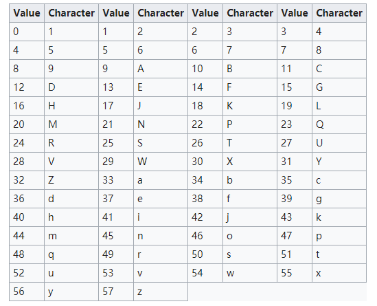

# base64编码

## 目的

为了能够做到人类友好。使用几个常用的字符来编码数据。

## 编码过程

1. 转化为ASCII编码

s 1 3 转化为 115 49 51

2. 转化为二进制编码

01110011 00110001 00110011

3. 6个一组

011100 110011 000100 110011

4. 按照如下的对应表编码 10+26+26+2 = 64

