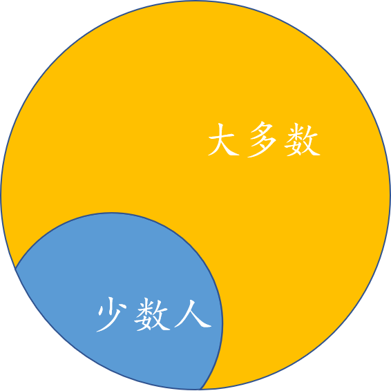

# the DAO攻击事件

> 2016年6月18日，以太坊网络上爆发了the DAO攻击事件，该事件直接导致了以太坊的硬分叉，同时让以太坊社区分裂为ETH和ETC两个社区。
> 在the DAO攻击发生两周年之际，我们回过头来细细回顾这起事件。搞起其中的原理，帮助我们编写出更好、更健壮的dapp。


## DAO的概念 

DAO是Decentralized Autonomous Organization的缩写，“去中心化”是指希望组织内部的成员都有高度的参与性，组织成员地位平等，共同决定组织的发展方向；“自治”是指希望尽可能地减少外界对该组织的干预，让组织内部人员决定组织的发展方向。


## The DAO 白皮书解读

The DAO是一个去中心化的风险投资基金，以智能合约的形式运行在以太坊区块链上。它也是一个盈利性的DAO（去中心化自治组织），它将利用自己掌控的以太币资金通过投资以太坊上的应用为其成员创造价值。

### 众筹

在The DAO创建期，任何人都可以向它的众筹合约（0xBB9bc244D798123fDe783fCc1C72d3Bb8C189413）发送以太币，获得DAO代币，这就是The DAO的众筹，为期28天（2016年4月30日到2016年5月28日）。前14天1个以太币可以兑换100个DAO代币；中间10天，每个以太币可以换的DAO数量线性减少，最后四天1.5个以太币换100个DAO代币。

上面关于代币数量的计算是参考白皮书中第5章——代币价格 推导出来的。

在众筹结束后，这些代币的所有权可以通过以太坊区块链的交易转移给其他用户。

### 提议

提议在the DAO的白皮书中以proposal 或者 offer 表示。

DAO的每一个成员都可以花费一部分众筹来的以太币来提交提议。如果建议被批准，以太币会发送到另外一个表示提议项目的合约中。这样，智能合约可以参数化，使DAO能与资助的项目相互作用并影响它。

每一个提议的表示形式都是一个智能合约，the DAO项目中有一个示例提议 https://github.com/TheDAO/DAO-1.0/blob/master/SampleOffer.sol

### 投票

DAO的成员投票权重由他们掌握的代币数量来决定。代币是可分割，无差别的，可以方便的在用户之间进行转移。在合约中，成员的个人行为不能被直接确定。任何提议都需要一个时间范围去讨论和投票。

在超过该时间范围之后，代币的持有者可以调用一个DAO合约中的函数来验证大多数的投票是支持提议的并达到了法定人数。如果是这种情况，提议将会执行；如果不是这种情况，提议将会关闭。

### 分割DAO

如果在DAO组织中，个人或者一群代币的所有者（下文中称为“少数人”），非常反对某项提议，在某项提议执行前想要取回他们的资金，他们可以提交一个特殊的提议来形成一个新的DAO。“少数人”可以投票将他们的资金转移到这个新的DAO中，使得剩下的“多数人”只能花费他们自己的钱。



在the DAO的智能合约中，使用splitDAO函数来完成DAO组织的分割的。该函数是黑客入侵的入口函数，在下面我会详细解释。

### 服务提供商

服务提供商在白皮书中使用curator表示。

每一个单独的DAO都对应着一个单独的服务提供商，这个服务提供方控制着一个唯一的账号，通过提议可以从DAO中接受。另外，服务器提供商可以创建DAO可以发送金额的白名单地址。这给了服务提供方非常大的权力。 为了防止滥用这种权力，DAO可以投票选择新的服务提供方。

## 如何分割DAO

> 在上面已经提到过DAO的分割，但是DAO的分割太重要了，黑客就是利用DAO分割中一个错误完成的攻击。所以我们再次细细研究以下DAO的分割

分割DAO 是指token 的所有者调用splitDAO函数，将自己持有的eth和token从原有的DAO中取出，并转到一个新的dao的过程。

分割DAO的流程如下：
1. 新建一个提议用来分割DAO。
2. 找到提议的ID（第3步投票、和第5步分隔DAO的时候需要用到提议的ID）。
3. 对你的提议投“YES”。
4. 等待若干天的辩论期。该天数取决于你在新建提议时，在“Debating Period”里指定的时间。最短是7天。
5. 调用Split DAO函数 - 现在你将正式的分割你的以太币和奖励代币，你不在是原DAO的一份子了。
6. 找到你的新的DAO地址，增加新的Watch Contract & Watch Token。
7. 等待27天的新的分割DAO的众筹期。
8. 等待27天的新的分割DAO的众筹期，将你的地址增加到白名单。
9. 新建提议发送所有的以太到这个地址。
10. 对这个提议投Yes。
11. 等待14天的投票期。
12. 执行提议。“现在你的以太币已经被发送到这个指定的地址了”。

## 项目代码分析

TokenCreation.sol 公募时候使用的智能合约，函数如下：

* createTokenProxy  
Token.sol 定义了检查token余额、发送token、代表第三方发送token以及相应的审批流程等


## 一些重要的合约地址：

黑客发动攻击的地址：  0xf35e2cc8e6523d683ed44870f5b7cc785051a77d
黑客使用的代理：0xf835a0247b0063c04ef22006ebe57c5f11977cc4
黑客使用的代理：0x56bcc40e5e76c658fad956ee32e4250bf97468a1

TheDAO是被攻击的合约；TheDarkDAO是黑客写的、用于吸取DAO中eth的合约；WhiteHatDAO是一帮白帽子写的，同样是为了吸取DAO中的eth。
在攻击时间后，DAO合约并没有停止更新，其GITHUB上的代码一直保持更新，现在最新版已经是修复之后的版本了。各位朋友想要研究出问题的代码的话可以看网友fork的DAO1.0的git仓库。

TheDAO合约: https://etherscan.io/address/0xbb9bc244d798123fde783fcc1c72d3bb8c189413#code
TheDarkDAO合约: https://etherscan.io/address/0x304a554a310C7e546dfe434669C62820b7D83490
WhiteHatDAO: https://etherscan.io/address/0xb136707642a4ea12fb4bae820f03d2562ebff487
WhitehatDao2: https://etherscan.io/address/0x84ef4b2357079cd7a7c69fd7a37cd0609a679106
未命名： https://etherscan.io/address/0xf4c64518ea10f995918a454158c6b61407ea345c
未命名： https://etherscan.io/address/0xaeeb8ff27288bdabc0fa5ebb731b6f409507516c


dao项目地址，不断更新
https://github.com/slockit/DAO


网友fork的dao-1.0版本，是发生攻击时候的合约版本。本文是在该版本的基础上进行分析的：
https://github.com/TheDAO/DAO-1.0

## 代码分析

DAO合约中的
DAO.sol：DAO的标准智能合约，用于管理自治组织并进行决策
DAOTokenCreationProxyTransferer.sol：
ManagedAccount.sol：基本的账户，用来管理reward账号和extraBalance账户。
SampleOffer.sol：开发小组给出一个示例offer，演示了从合同商到DAO组织的offer应该怎么写
Token.sol：检查token的余额，发送token，代表第三方发送相应的代币
TokenCreation.sol：创建Token的智能合约，用来出售token获得初始的eth。

项目的主要文件就是DAO.sol，下面我们从DAO.sol开始分析

### splitDAO函数的定义如下（DAO.sol 240行）：
```solidity
/// @notice ATTENTION! I confirm to move my remaining ether to a new DAO
/// with `_newCurator` as the new Curator, as has been
/// proposed in proposal `_proposalID`. This will burn my tokens. This can
/// not be undone and will split the DAO into two DAO's, with two
/// different underlying tokens.
/// @param _proposalID The proposal ID 用户提议的proposal的ID
/// @param _newCurator The new Curator of the new DAO新DAO的管理者
/// @dev This function, when called for the first time for this proposal,
/// will create a new DAO and send the sender's portion of the remaining
/// ether and Reward Tokens to the new DAO. It will also burn the DAO Tokens
/// of the sender.
function splitDAO(
    uint _proposalID,
    address _newCurator
) returns (bool _success);
```

如果你不同意某个提议或负责人，想要分割DAO，你可以调用该函数。这是去确保DAO的去中心化和自治。
你应该明白分割并不是很难，只是需要一些步骤和时间。需要（最少）7天分割DAO，来将你的的以太币和奖励代币转移到某个地址，使它完全在你的掌控之中。尽管如此，仍然需要48天去“提现”以太币到标准的账户，然后你就可以发送或者交易。你需要一些操作，等待7天，再操作，再等待27天，再操作，再等待14天，然后最终以太币才会回到你掌控的帐号中。

详细的分隔流程见：https://ethfans.org/posts/split-the-dao-get-back-ether

### splitDAO函数的实现如下(DAO.sol 599行)：
```solidity
function splitDAO(
	uint _proposalID,
	address _newCurator
) noEther onlyTokenholders returns (bool _success) {
	bla bla bla...
}
```
该函数不发送eth，只能被持有token的人调用。

608~621行做正确性验证，检查投票是否截至，是否过期等等

623~637行检查新的DAO是否已经存在，如果不存在则会新建一个DAO

639行开始，是真正重要的地方：
```solidity
// 计算出应该向调用者发送多少eth
uint fundsToBeMoved =
(balances[msg.sender] * p.splitData[0].splitBalance) /
p.splitData[0].totalSupply;
// 创建token的方法
if (p.splitData[0].newDAO.createTokenProxy.value(fundsToBeMoved)(msg.sender) == false)
	throw;


// Assign reward rights to new DAO
uint rewardTokenToBeMoved =
(balances[msg.sender] * p.splitData[0].rewardToken) /
p.splitData[0].totalSupply;

uint paidOutToBeMoved = DAOpaidOut[address(this)] * rewardTokenToBeMoved /
rewardToken[address(this)];

rewardToken[address(p.splitData[0].newDAO)] += rewardTokenToBeMoved;
if (rewardToken[address(this)] < rewardTokenToBeMoved)
throw;
rewardToken[address(this)] -= rewardTokenToBeMoved;

DAOpaidOut[address(p.splitData[0].newDAO)] += paidOutToBeMoved;
if (DAOpaidOut[address(this)] < paidOutToBeMoved)
throw;
DAOpaidOut[address(this)] -= paidOutToBeMoved;

// 注意这里，为msg.sender记录的dao币余额归零、扣减dao币总量totalSupply等等都发生在将发回msg.sender之后，这是一个典型“反模式”。
Transfer(msg.sender, 0, balances[msg.sender]);
// 调用withdrawRewardFor函数
withdrawRewardFor(msg.sender); // be nice, and get his rewards
totalSupply -= balances[msg.sender];
balances[msg.sender] = 0;
paidOut[msg.sender] = 0;
return true;
```

### withdrawRewardFor函数（DAO.sol 716行）
```solidity
    function withdrawRewardFor(address _account) noEther internal returns (bool _success) {
        if ((balanceOf(_account) * rewardAccount.accumulatedInput()) / totalSupply < paidOut[_account])
            throw;

        uint reward =
            (balanceOf(_account) * rewardAccount.accumulatedInput()) / totalSupply - paidOut[_account];
        // 调用paidOut函数
        if (!rewardAccount.payOut(_account, reward))
            throw;
        
        paidOut[_account] += reward;
        return true;
    }
```

### payOut函数（ManagedAccount.sol 57行）
```solidity
   function payOut(address _recipient, uint _amount) returns (bool) {
        if (msg.sender != owner || msg.value > 0 || (payOwnerOnly && _recipient != owner))
            throw;
        // 注意这里 _recipient.call.value(_amount)()是不需要消耗gas的
        if (_recipient.call.value(_amount)()) {
            PayOut(_recipient, _amount);
            return true;
        } else {
            return false;
        }
    }
```

## 攻击

1. 创建一个钱包合约，在合约中写一个默认函数，在默认函数多次调用splitDAO函数，不要调用太多的次数
2. 创建一个分割协议，设置参数recipient（指的是该协议的负责人）为第一步中的钱包地址
3. 等待7天的分割期
4. 调用splitDAO函数

调用栈如下
```
splitDao
  withdrawRewardFor
	 payOut
		recipient.call.value()()
		   splitDao
			 withdrawRewardFor
				payOut
				   recipient.call.value()()
```

1. 提出一个split然后等待直达表决期限到期。（DAO.sol, createProposal）
2. 运行split。（DAO.sol, splitDAO）
3. 让DAO发送一份额的代币到新DAO(splitDAO -> TokenCreation.sol, createTokenProxy)
4. 确保DAO在（3）之后在更新你的余额之前尝试发送给你收益。（splitDAO -> withdrawRewardFor -> ManagedAccount.sol, payOut）
5. 当DAO在步骤（4）时，以与（2）相同的参数再次运行splitDAO 。（payOut -> _recipient.call.value -> _recipient()）
6. DAO将会发送给你更多的子代币，并在更新你的余额之前撤销对你的收益。（DAO.sol, splitDAO）
7. 返回（5）！
8. 让DAO更新你的余额。因为（7）返回到（5），所以这将不会发生。

综合以上思路，攻击者想要达到两个目的：
1. 能够持续运行这个合约。即迭代运行。 
2. 能够利用漏洞，转钱到自己的账户，且不会因为交易费机制而终止交易。即交易成本要低于转账总额。

## 软分叉

为了解决TheDAO大量资金被盗的问题，尽管争议颇多，以太坊官方还是推出了针对TheDAO的软分叉版本Gethv1.4.8，该版本增加了一些规则以锁定黑客控制的以太币，以便有更多时间留给社区去解决TheDAO的问题。在六月底的数据显示，绝大多数矿工都升级了这个版本的软件，眼看着软分叉就要大功告成了。

也许TheDAO就是命运多舛，不知是否因为时间仓促，众多大牛编写出来的软分叉版本居然又有漏洞！这个漏洞比较明显，简单地说，每个以太坊上的交易，验证节点（矿工）都会检查是否与TheDAO智能合约及其子DAO的地址相关。如果是则拒绝这个交易，从而锁定TheDAO（包括黑客在内）的所有资金。这个逻辑实现本身并没有问题，但是却没有收取执行交易的燃料费（gas）。当初以太坊设计的gas有两个作用：支付矿工的交易费和增加潜在攻击者的成本。取消交易燃料费后，导致了非常严重的后果：以太坊网络成为了DoS（DenialofService）的攻击目标（如同我国高速公路在法定节假日免费通行造成大塞车的情况一样），攻击者可以零成本地发起大量攻击，使得整个网络彻底瘫痪。因为这个漏洞，各个节点回滚了软件版本，软分叉方案失败！

## 参考文献

https://ethfans.org/topics/242 参与众筹的详细步骤
https://ethfans.org/posts/114
https://ethfans.org/topics/351  The DAO 合约攻击信息汇总
https://ethfans.org/posts/split-the-dao-get-back-ether 分隔dao的教程
https://vessenes.com/deconstructing-thedao-attack-a-brief-code-tour/
https://vessenes.com/more-ethereum-attacks-race-to-empty-is-the-real-deal/
https://www.jubi.com/shanzhaibi/1748.html