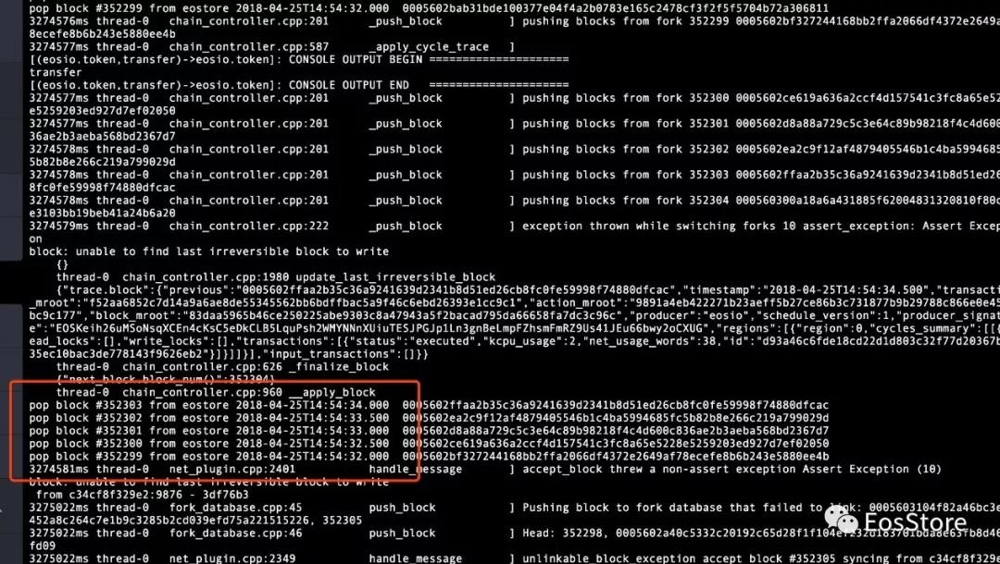

# EOS BP节点的配置与部署方案
>  EOS BP指的是EOS Block Producer，EOS超级节点

## 区块链和EOS的大致原理

EOS：柚子可以理解为Enterprise Operation System，即为商用分布式应用设计的一款区块链操作系统。

EOS是 http://EOS.IO 软件引入的一种新的区块链架构，旨在实现分布式应用的性能扩展。注意，它并不是像比特币和以太坊那样是货币，而是基于 http://EOS.IO 软件项目之上发布的代币，被称为区块链3.0。

在BM做第一版DPOS的时候，他锁定了101个生产者，且都是由投票选举产生的，Bitshare2.0(石墨烯)把101这个数字调整为可由用户自定义，以便当人们投票时，在通过票数上可以自由调节。当一个社区处于可控状态时，可票选节点数通常在15个左右，为了便于更“去中心化”运行，最终节点数字被设定为略高的21。这21个节点的出块顺序全部由系统随机设定，并且随时会变，这样既能有效率地升级，同时也能避免硬分叉。

## 获得和编译代码

获取代码 和 编译代码
```bash
git clone https://github.com/EOSIO/eos --recursive
cd eos
./eosio_build.sh
```

编译完之后就可以看到代码的目录如下：
Build目录是新生成的，其中包含了：programs、tools和contract目录，其中programs是EOS主要的程序目录包括nodeos。

## 配置文件

### config.ini
```ini
#Track only transactions whose scopes involve the listed accounts. Default is to track all transactions.
# filter_on_accounts =

# Limits the maximum time (in milliseconds)processing a single get_transactions call.
get-transactions-time-limit = 3

# File to read Genesis State from
genesis-json =/root/.local/share/eosio/nodeos/config/genesis.json

# override the initial timestamp in theGenesis State file
# genesis-timestamp =

# the location of the block log (absolute path or relative path to application data dir)
block-log-dir = "blocks"

# Pairs of [BLOCK_NUM,BLOCK_ID] that should be enforced as checkpoints.
# checkpoint =

# the location of the chain shared memory files (absolute path or relative to application data dir)
shared-file-dir = "blockchain"

# Minimum size MB of database shared memoryfile
shared-file-size = 8192

# The local IP and port to listen forincoming http connections.
http-server-address = 0.0.0.0:8888

# Specify the Access-Control-Allow-Origin to be returned on each request.
access-control-allow-origin = *

# Specify the Access-Control-Allow-Headers to be returned on each request.
# access-control-allow-headers =

# Specify if Access-Control-Allow-Credentials: true should be returned on each request.
access-control-allow-credentials = false

# The actual host:port used to listen forincoming p2p connections.
# 这里填写p2p网络的端口
p2p-listen-endpoint = 0.0.0.0:9876

# An externally accessible host:port foridentifying this node. Defaults to p2p-listen-endpoint.
# 这里填写你自己的服务器地址和监听的端口, 一般是 IP:9876
p2p-server-address =192.168.20.155:9876

# The public endpoint of a peer node toconnect to. Use multiple p2p-peer-address options as needed to compose anetwork.
#这里填写对端网络的地址
p2p-peer-address = 192.168.20.218:9876

# The name supplied to identify this nodeamongst the peers.
# 这里填写你自己的节点标识
agent-name = "master155"

# True to always send full blocks, false tosend block summaries
send-whole-blocks = 1

# Can be 'any' or 'producers' or'specified' or 'none'. If 'specified', peer-key must be specified at leastonce. If only 'producers', peer-key is not required. 'producers' and'specified' may be combined.
allowed-connection = any

# Optional public key of peer allowed toconnect.  May be used multiple times.
# peer-key =

# Tuple of [PublicKey, WIF private key](may specify multiple times)
# peer-private-key =
# Log level: one of 'all', 'debug', 'info','warn', 'error', or 'off'
log-level-net-plugin = info

# Maximum number of clients from which connectionsare accepted, use 0 for no limit
max-clients = 25

# number of seconds to wait before cleaningup dead connections
connection-cleanup-period = 30

# True to require exact match of peernetwork version.
network-version-match = 0

# Enable block production, even if thechain is stale.
enable-stale-production = false

# Percent of producers (0-100) that must beparticipating in order to produce blocks
required-participation = 33

# ID of producer controlled by this node(e.g. inita; may specify multiple times)
# 这里填写节点用户名
producer-name = alex

# Tuple of [public key, WIF private key](may specify multiple times)
# 这里填写一对密钥对, 建议用全新的
private-key = ["公钥","私钥"]
plugin = eosio::producer_plugin
plugin = eosio::chain_api_plugin
plugin = eosio::wallet_api_plugin
plugin = eosio::account_history_api_plugin
plugin = eosio::http_plugin
#plugin = eosio::mongo_db_plugin
#mongodb-uri =mongodb://127.0.0.1:27017/test1
# mongodb-queue-size = 256
# Enable block production with the testnetproducers
```

### genesis.json

```json
{
	"initial_timestamp": "2018-04-06T12:00:00.000",
	#EOSIO的公钥"initial_key": "EOS7jczheafPWuKZMnGNcLzC1WHQGPSWbFDKExyJREBeLJ3wQiTCk",
	"initial_configuration": {
		"base_per_transaction_net_usage": 100,
		"base_per_transaction_cpu_usage": 500,
		"base_per_action_cpu_usage": 1000,
		"base_setcode_cpu_usage": 2097152,
		"per_signature_cpu_usage": 100000,
		"per_lock_net_usage": 32,
		"context_free_discount_cpu_usage_num": 20,
		"context_free_discount_cpu_usage_den": 100,
		"max_transaction_cpu_usage": 10485760,
		"max_transaction_net_usage": 104857,
		"max_block_cpu_usage": 104857600,
		"target_block_cpu_usage_pct": 1000,
		"max_block_net_usage": 1048576,
		"target_block_net_usage_pct": 1000,
		"max_transaction_lifetime": 3600,
		"max_transaction_exec_time": 0,
		"max_authority_depth": 6,
		"max_inline_depth": 4,
		"max_inline_action_size": 4096,
		"max_generated_transaction_count": 16
	},
	"initial_chain_id": "0000000000000000000000000000000000000000000000000000000000000000"
}
```

## 多节点共用一套公私钥，大致配置方式结果及解决办法。

此种方法一般刚刚接触EOS的人都会想到，比如在A B两台设备上都运行了nodeos，且用同样的一对公私钥，设想是在A设备无法提供服务的时候（比如设备down机时）运行了同样公私钥的B设备仍然可以提供服务，在没有交易的时这种方法貌似不会产生问题，但当交易量上升，就会出现双重签名，如下图所示：



但是此种方法给我提供了一个解决问题的方向，即：A B两台服务器同时运行nodeos，但A作为BP节点，B仅作为普通全节点。当A 发生故障无法提供BP服务时，通过一个通知机制告诉B，B切换身份（更换为A的公私钥），代替A作为BP节点。

之所以这种方法能够通过不同的换公私钥解决，是因为在EOS网络中IP地址不是区分BP节点身份的因为，公私钥才是BP节点身份的象征。

基于这种构想，我们引入了下面两种方法完成公私钥的切换：

### N个节点通过keep alive实现高可用方案：

keepalived是一个类似于layer3, 4 & 5交换机制的软件，也就是我们平时说的第3层、第4层和第5层交换。Keepalived的作用是检测web服务器的状态，如果有一台web服务器死机，或工作出现故障，Keepalived将检测到，并将有故障的web服务器从系统中剔除，当web服务器工作正常后Keepalived自动将web服务器加入到服务器群中，这些工作全部自动完成，不需要人工干涉，需要人工做的只是修复故障的web服务器。


测试环境中一共三个节点A、 B、 C，其中A为eosio的出块节点，B C上配置了BP为Alex的公私钥（config.ini文件中），B C节点上安装keepalive程序，具体配置命令如下：

1. 安装keeplived：yum install–y keeplived
2. 打开并修改keepalived.conf：vim /etc/keepalived/keepalived.conf
3. B节点的配置文件：
```conf
global_defs{
   notification_email {
     alex@eos.store
}
   notification_email_from bp@eos.store
   smtp_server smtp.eos.store
   smtp_connect_timeout 30
   router_id LVS_DEVEL
   vrrp_skip_check_adv_addr
   vrrp_strict
   vrrp_garp_interval 0
   vrrp_gna_interval 0
}
vrrp_scriptchk_nodeos {
        script"/root/check_nodeos.sh"
        interval 1
        weight -2
}
vrrp_instanceVI_1 {
    state BACKUP
    interface ens192
    virtual_router_id 51
    priority 99
    nopreempt
    advert_int 1
    authentication {
        auth_type PASS
        auth_pass 1111
    }
    track_script {
        chk_nodeos
    }
    virtual_ipaddress {
        13.250.11.2
    }
    notify_master "/root/launch_nodeos_with_bp.sh"
    notify_backup"/root/launch_nodeos_with_common.sh"
}
```

4. C节点的配置文件：

```conf
global_defs{
   notification_email {
     alex@eos.store
 }
   notification_email_from bp@eos.store
   smtp_server smtp.eos.store
   smtp_connect_timeout 30
   router_id LVS_DEVEL
   vrrp_skip_check_adv_addr
   vrrp_strict
   vrrp_garp_interval 0
   vrrp_gna_interval 0
}
vrrp_scriptchk_nodeos_live {
        script"/root/check_nodeos.sh"
        interval 1
        weight -2
}
vrrp_instanceVI_1 {
    state MASTER
    interface ens192
    virtual_router_id 51
    priority 100
    nopreempt
    advert_int 1
    authentication {
        auth_type PASS
        auth_pass 1111
    }
    track_script {
        chk_nodeos_live
    }
    virtual_ipaddress {
        13.250.11.2
    }
    notify_master"/root/launch_nodeos_with_bp.sh"
        notify_backup"/root/launch_nodeos_with_common.sh"
```

通过配置文件可以看出节点B为默认master节点，C为默认backup节点。

其中涉及了3个脚本，分别是check_nodeos.sh、launch_nodeos_with_bp.sh、launch_nodeos_with_common.sh
* check_nodeos.sh用来判断本节点上的nodeos是否工作正常
* lanuch_nodeos_with_bp.sh负责启动作为BP节点的nodeos进程
* lanuch_nodeos_with_common.sh负责启动作为全节点的nodeos进程。


6.  各自内容如下：
```bash
cat /root/launch_nodeos_with_bp.sh
pgrep nodeos|xargs kill
rm -rf /root/.local/share/eosio/nodeos/config/config.ini
ln -s /root/.local/share/eosio/nodeos/config/config.ini.bp/root/.local/share/eosio/nodeos/config/config.ini
nodeos 1>/root/nodeos.log 2>&1 &

cat /root/launch_nodeos_with_common.sh
pgrep nodeos|xargs kill
rm -rf /root/.local/share/eosio/nodeos/config/config.ini
ln -s /root/.local/share/eosio/nodeos/config/config.ini.common/root/.local/share/eosio/nodeos/config/config.ini
nodeos  1>/root/nodeos.log2>&1 &

cat /root/check_nodeos.sh
#!/bin/bash
curl http://127.0.0.1:8888/v1/chain/get_info  >> /root/check_nodeos.log 2>&1
exit $?
```

7. genesis.json配置文件所有节点都一致，config.ini全节点和BP节点的区别是：BP节点会设置private-key、producer-name和plugin = eosio::producer_plugin其他内功相同。

8. 测试步骤：
* 分别在B、C节点systemctl start keepalived
* 此时会看到B启动了一个全节点的nodeos，C启动了一个BP节点的nodeos
* kill掉C节点上的nodeos，此时观察B节点自动重启并切换到BP节点角色，C节点变成全节点。浮动IP会漂浮到B节点上。
