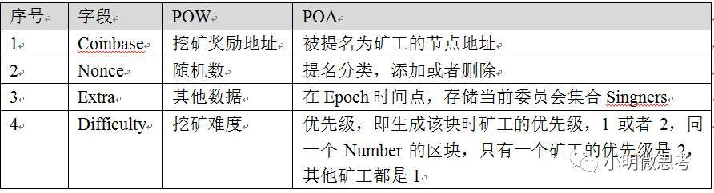

# PoA共识算法

> 由Parity Technologies首创的权威证明（POA，Proof of Authority）

## PoA的header的数据结构

## 一些概念和定义
* EPOCH_LENGTH: epoch长度是30000个block, 每次进入新的epoch,前面的投票都被清空,重新开始记录,这里的投票是指加入或移除signer
* BLOCK_PERIOD: 出块时间, 默认是15s
* UNCLE_HASH: 总是 Keccak256(RLP([])) ,因为没有uncle
* SIGNER_COUNT: signers的数量
* SIGNER_LIMIT:  等于 (SIGNER_COUNT / 2) + 1 . 每个singer只能签名连续SIGNER_LIMIT个block中的1个
* NONCE_AUTH: 表示投票类型是加入新的signer; 值= 0xffffffffffffffff
* NONCE_DROP:  表示投票类型是踢除旧的的signer; 值= 0x0000000000000000
* EXTRA_VANITY:  代表block头中Extra字段中的保留字段长度: 32字节
* EXTRA_SEAL: 代表block头中Extra字段中的存储签名数据的长度: 65字节
* IN-TURN/OUT-OF-TURN: 每个block都有一个in-turn的signer, 其他signers是out-of-turn, in-turn的signer的权重大一些, 出块的时间会快一点, 这样可以保证该高度的block被in-turn的signer挖到的概率很大

## signer对区块头进行签名
1. Extra的长度至少65字节以上(签名结果是65字节,即R, S, V, V是0或1)
2. 对blockHeader中所有字段除了Extra的后65字节外进行RLP编码
3. 对编码后的数据进行 Keccak256 hash
4. 签名后的数据(65字节)保存到Extra的 后65字节 中
