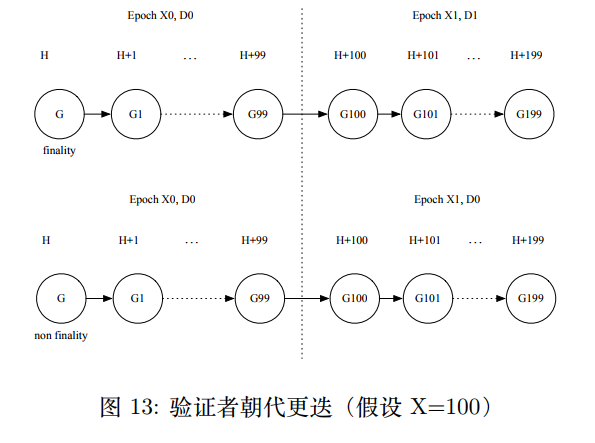
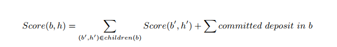
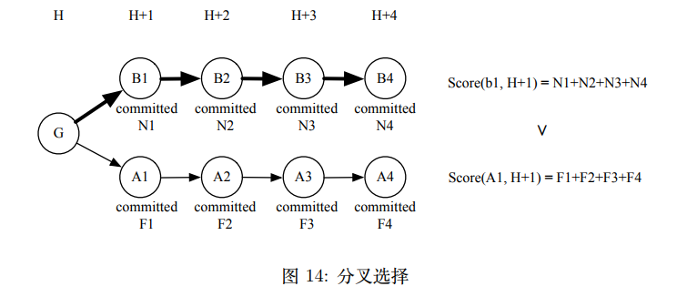
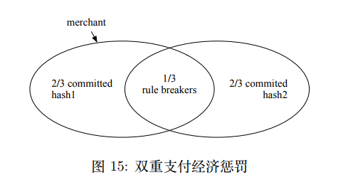
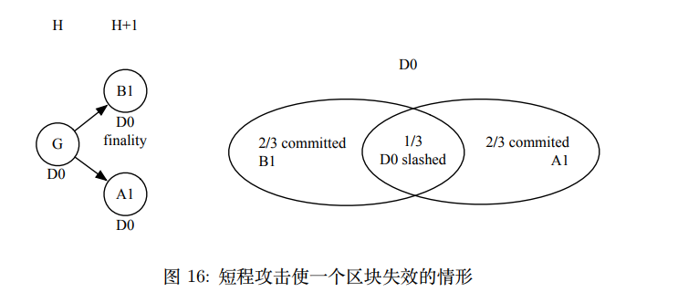
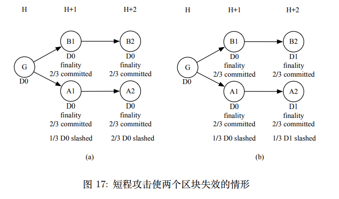
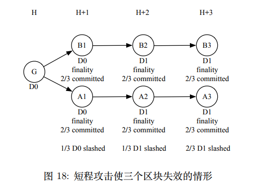

# PoD共识算法

> 贡献度证明共识算法，由星云链首次提出并运用在公网中

## 提议者

在给定验证者集合 (validators set) 之后，PoD 算法通过伪随机数来决定验证者集合中谁是新的区块的提议者 (proposer)，提议者产⽣新区块。

## 验证者集合

类似 PoI 共识算法选取重要性⾼的账户，PoD 将选取⽣态中贡献度较⾼的账户，不同之处在于PoD赋予选取出来的账户平等概率的记账权来参与产⽣新区块 (block)，防⽌概率倾斜衍⽣垄断。

在选择贡献度较⾼的账户时，我们使⽤了星云链原⽣的 NR 普适价值尺度评估。在 NR 的算法设计中，着重考虑了账户的流动性和传播性，我们认为满⾜这些性质的账户对⽣态建设贡献度较⾼。所以
在 PoD 中，将选取 NR 排名 Top N 的账户，这些账户⾃愿缴纳⼀定数量的 Nas 作为押⾦后则有资格成为新区块的验证者 (validator)，参与记账。

验证者集合不是固定不变的，有资格的账户可以选择加⼊或者退出验证者集合，⽽随着周期性 NR 的变化，有资格的账户也会不⼀样。所以我们在 PoD 设计了验证者集合动态变化机制，来实现验证者集合的更迭。

## 验证者集合更迭

验证者集合的更迭就如朝代变更⼀样，于是我们将验证者集合按照朝代 (dynasty) 做划分，⼀个朝代内验证者集合不会发⽣变化。⼀个朝代不能更迭地过快，⾄少要保持⼀段时间不做变更，因此我们将每 X 个区块定义为⼀个 Epoch，在同⼀个 Epoch 中朝代不会发⽣变化。

所以朝代的变更只会发⽣在 Epoch 交接时，在此时将会考察上⼀个 Epoch 的第⼀个区块，如果此区块到达了 finality 状态，那么当前 Epoch 进⼊下⼀个朝代 D1，否则延续上⼀个朝代 D0 不变，如图13所⽰。

由于⽹络延迟，各个节点可能在朝代更迭时，看到的区块 G 是否 finality 的状态不⼀致，所以参考Casper 的动态验证集策略，要求每⼀个朝代的共识过程将由当前朝代和上⼀个朝代的验证者集合共同完成。

因此在任意⼀个朝代，有资格的账户只能申请加⼊或者退出 D+2 朝代的验证者集合，当朝代变更到D+2 时，才可加⼊新区块的共识过程。

## 共识过程

新的区块被提出后，当前朝代验证者集合中所有⼈将会参与⼀轮 BFT (Byzantine Fault Tolerant) ⽅式的投票，来确定此区块的合法性。

在投票最开始，每⼀个参与此区块共识的验证者将会被从押⾦中收取 2x(x 为激励奖⾦⽐例) 的保证⾦，然后进⼊两阶段的投票过程。

第⼀阶段，所有验证者需要对新区块投 Prepare 票，投完 Prepare 票的验证者将获得 1.5x 的奖励，如果在当前朝代和上⼀个朝代中都有超过 2/3 的押⾦总额的验证者对新区块投了 Prepare 票，那么该区块进⼊投票的第⼆阶段。此处需要说明，新区块的提议者将被默认对新区块投 Prepare 票。

第⼆阶段，所有验证者需要对新区块投 Commit 票，投完 Commit 票的验证者，可以再获得 1.5x 的奖励，如果在当前朝代和上⼀个朝代中都有超过 2/3 的押⾦总额的验证者对新区块投了 Commit 票，那么该区块到达 finality 状态。

为了加速整个⽣态向前延展，如果区块 b 的 P repare 和 Commit 票的时间戳和区块 b 的时间戳相差超过 T，那么这些票将被视为过期，直接忽略。

## 分叉选择

PoD 算法以每个⾼度上区块的得分来选择权威链，总是选择得分最⾼的区块加⼊权威链，在⾼度 h 的区块 b 的得分如下

即为该区块及其所有后代区块收到的 commit 票对应的押⾦总和，如图14所⽰。

## 投票规则

为了避免共识过程被恶意破坏，导致共识过程没法完成，阻碍⽣态发展，PoD 参考 Casper 的最⼩惩罚规则 [36] 来约束验证者的共识活动。

假设共识过程中的 P repare 和 Commit 票结构如下，
* Prepare(H, v, vs)，其中 H 为当前区块 hash，v 表⽰当前区块⾼度，vs 表⽰ v 的某个祖先区块高度
* Commit(H, v)，其中 H 为当前区块 hash，v 表⽰当前区块⾼度

-----------------------------------

PoD 算法为整个投票过程制定了如下 4 条基本规则，
1. 单个区块的两阶段共识过程存在严格的先后顺序，只有在第⼀阶段 P repare(H, v, vs) 票总权值达到2/3 后，验证者们才可以投出第⼆阶段的 Commit(H, v) 票，
2. 多区块间不强制⼀个区块共识结束后才能开始后⼀个区块的共识，允许交织共识 (interwoven consensus)，但是不能完全没有秩序，只有⾼度vs 完成了第⼀阶段过程，拥有 2/3 的Prepare(Hanc, vs, vs’)后，才可以基于 vs 对其后代区块投 Prepare(H, v, vs) 票，保证交织稳步向前
3. 为了避免有节点利⽤交织共识恶意跨多区块投票，要求基于⾼度 u 投出了 P repare(H, w, u) 票之后，对于⾼度在跨度 u 和 w 之间的所有区块，不能再投出 Commit(H, v) 票，保证共识过程的⾼效有序
4. 为了制⽌节点⽤同⼀笔押⾦在多个分⽀上同时下注，导致 nothing at stake 的问题，要求在⼀个⾼度投出 Prepare(H1, v, vs1) 票之后，不能再投出不⼀样的 Prepare(H2, v, vs2) 票违反上述规则的验证者⼀旦被举报核实，将会被罚掉所有押⾦，举报者们将会共享罚⾦的 4% 作为奖励，罚⾦的剩余部分将会被销毁。

---------------

# PoD 经济分析

## 激励分析
参与 PoD 算法的验证者，在每⼀个合法区块上可以获得 1x 的星云币奖励，如果⽹络不畅或者有⼈作弊导致 Prepare 阶段没有办法完成进⼊ Commit 阶段，那么所有验证者将损失 0.5x。因此成为验证者的价值节点在保持⽹络畅通，不参与作弊的情况下，将共享⼤量记账收益。

## 作弊分析

### 双重⽀付攻击 (double spend)
假设商户 merchant 等到新区块到达 finality 状态就确认交易发货，那么 fraud 要在 PoD 共识算法下完成双重⽀付攻击实现零成本购物要付出的最⼩代价如下：

⾸先，fraud 需要提⾼⾃⼰的 Nebulas Rank 到 Top N，然后缴⼀定数的 NaS 作为押⾦成为验证者，并申请参与 D+2 朝代区块的验证。

然后，fraud 需要被伪随机算法选中为新区块的提议者，此时 fraud 提出两个⾼度相同的新区块，⼀个哈希值为 hash1 包含 fraud 向 merchant 的转账交易，另⼀个哈希值为 hash2 包含 fraud 向 fraud ⾃⼰的转账交易。

最后，为了让 hash1 和 hash2 区块都到达 finality，如下图所⽰，fraud ⾄少需要花费所有押⾦的 1/3来贿赂 1/3 的验证者，让他们给两个区块都投 Commit 票。

所以要完成⼀次成功的双重⽀付攻击，fraud 需要花费⼀定的精⼒和财⼒来提升⾃⼰的 Nebulas Rank排名（见 §2.4抵抗操纵），然后等到幸运地被选为提议者时，⾄少花费总押⾦的 1/3 来让两个块同时到达finality 状态。

### 51% 攻击

在 PoW 中要发起 51% 攻击需要 51% 的算⼒，在 PoS 中则需要 51% 的押⾦，⽽在 PoD 中，则需要
验证者集合中 51% 的账户，这意味着拥有⾜够多的⾼声望⽤户进⼊ Nebulas Rank 的 Top N，并且需要⽀付对应的押⾦，因此在 PoD 中 51% 攻击将更为困难。

### 短程攻击

PoD 中的每个⾼度上的区块都有共识有效期，如果某个⾼度距离最新⾼度超过 100 时，该⾼度的所有区块在共识过程中将被视为过期，那么这些区块上的所有新的共识活动将会被直接忽略。

因此要在 PoD 中完成长程攻击 (long-range attack) ⼏乎不可能，但是在有效期内依旧存在发起短程攻击的可能性。

短程攻击者 Attacker 试图在⾼度 H+1 的区块还没有过期的情况下，伪造 A 链来替代 B 链成为权威链，Attacker 需要让区块 A1 的得分⽐ B1 更⾼。由于多投会被严惩，所以 Attacker 将不可避免地贿赂验证者，否则⽆法完成短程攻击。为了展现 PoD 共识算法的安全性，下⾯分别分析使不同数量的区块失效时，Attacker 需要付出的代价。

如果 Attacker 想要使 B1 失效，最⼩代价的情况如图16，就相当⼀次双重⽀付攻击，Attacker 幸运地成为了 H+1 ⾼度的区块提议者，那么⾄少需要贿赂朝代 D0 中 1/3 的验证者多投使 A1 达到finality，最⼩代价为所有押⾦的 1/3。

如果 Attacker 想要使 B1-B2 失效，假设 B1 和 B2 都已到达 finality，块中交易都已⽣效，为了让这些交易失效，这⾥考虑两种情况。

第⼀种如图17中 (a) 所⽰，⾼度 H+1 和 H+2 在同⼀个 Epoch 中，朝代相同，那么 Attacker ⾸先需要贿赂 D0 中 1/3 的验证者使 A1 达到 finality，此时这 1/3 的验证者将会被惩罚，押⾦被罚完。在 A2 的验证中整体押⾦总和只有 A1 中的 2/3，此时 Attacker 想要让 A2 到达和 B2同价值的 committ 票，需要贿赂剩下所有没有作弊的验证者，合起来⾄少需要损失总押⾦的 3/3，即使如此也不能保证 A1 得分⽐ B1 ⾼，攻击失败风险⾼。

第⼆种情况如图17中 (b) 所⽰，⾼度 H+1 和 H+2 正好在不同的 Epoch 中，且朝代不相同，那么此时 Attacker 需要贿赂 D0 中的 1/3 来让 A1 到达 finality，然后贿赂 D1 中的 1/3 来让 A2 达到 finality，完成⼀次这样的攻击⾄少需要损失总押⾦的 2/3。

综上，想要发起短程攻击导致两个 finality 区块失效，⾄少需要花费总押⾦ 2/3 的代价。

如果 Attacker 想要使 B1-B3 失效，如图18所⽰，Attacker ⾸先需要贿赂 D0 中 1/3 的⼈完成 A1 的finality，然后贿赂 D1 中 1/3 的⼈完成 A2 的 finality，最后需要贿赂 D1 中剩下 2/3 中的所有⼈完成A3 的 finality，综上⾄少要损失总押⾦的 4/3。要完成这些攻击准备将会⼗分困难，⽽且即使有幸做到了，也不定能保证 A1 的得分⽐ B1 ⾼，攻击也可能会失败。

如果 Attacker 想要使 B1-BN 失效，其中 N 受到区块共识有效期的限制，不会很⼤，由于 N = 3 时当前朝代所有验证者的押⾦就会被全部罚完，所以 N >= 4 时，将没法完成攻击让 B1 得分⽐ A1 ⾼，使B1-BN 失效，发起这样的攻击没有任何意义。