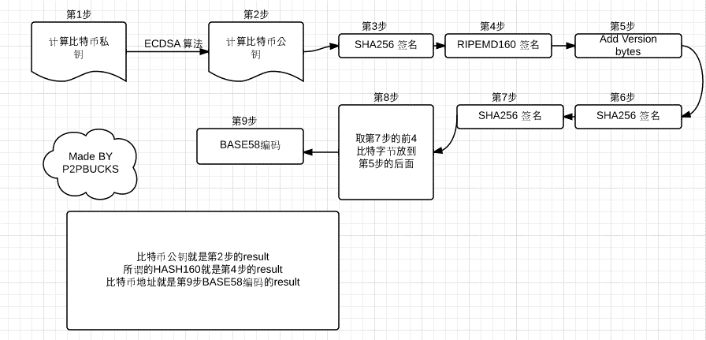

# 各种公链上的地址

## bitcoin的地址
1. 生成一个256 bits长的随机数作为私钥
2. 通过椭圆曲线算法从私钥中计算出公钥，具体使用的是secp256k1标准定义的一条特殊曲线和一系列的数学常数
3. 对公钥做加密哈希，得到比特币地址

### 具体过程：
1. 随机选择一个 256 bits的二进制串，作为私钥
2. 使用椭圆曲线加密算法（ECDSA-secp256k1）计算私钥所对应的非压缩公钥（一共有65个字节，1个字节是0x04，32个字节是x坐标，32个字节是y坐标）
3. 计算公钥的sha-256哈希值
4. 取上一步的结果，计算RIPEMD-160哈希值
5. 取上一步的结果，前面加上地址版本号（比特币主网的版本号0x00）
6. 取上一步的结果，计算sha-256哈希值
7. 取上一步的结果，计算sha-256哈希值
8. 取上一步结果的前4个字节，这四个字节做校验用
9. 把上一步得到的4个字节加在第五步的结果的后面，这一步得到的是比特币地址的16进制形态
10. 使用base58对上一步的结果进行编码
  

### 表示形式
1. BASE58
2. WIF压缩格式
3. 130位公钥格式
4. 66位公钥格式

## ethereum的地址
1. 选择256 bits的随机密钥
2. 利用私钥推导出512 bits的公钥，ECDSA椭圆曲线签名算法，secp256k1
3. 利用keccak哈希函数得到160 bits的地址

## nebulas的地址

### 账户地址

1.  content = ripemd160(sha3_256(public key))
    length: 20 bytes

2.  checksum = sha3_256( |  0x19  +  0x57  |      content     | )[:4]
    length: 4 bytes

3.  address = base58( |    0x19  |  0x57   |     content     |  checksum  | ）
    length: 35 chars

这里的base58直接使用bitcoin的实现。
注意0x19被编码之后得到小写字母n，这也是为什么nebulas上的地址全部是以n开头的原因。
这里的0x57代表该地址是账户地址。

## 合约地址

1.  content = ripemd160(sha3_256(tx.from, tx.nonce))
    length: 20 bytes

2.  checksum = sha3_256( |  0x19  |  0x58  +      content     | )[:4]
    length: 4 bytes

3.  address = base58( |  0x19  |  0x58   |     content     |  checksum  | ）
    length: 35 chars