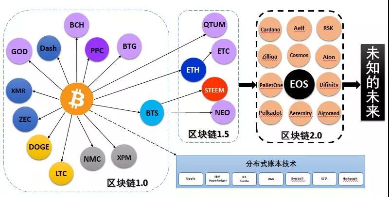

## BlockcoinDemo

### 课程1 blockchain demo
> 快速全面地了解区块链运行机制

可以自己体验https://anders.com/blockchain/
源码已经公开https://github.com/anders94/blockchain-demo

### 课程2 Public&Private Keys
> 了解公私钥，签名

原码已经公开https://github.com/anders94/public-private-key-demo

## 基于账户 和 基于UTXO
### 基于账户的
当张三要付给李四20元时，做以下操作：

1. 检查张三账户余额是否充足，如果不足20元就终止交易，向张三报“余额不足”
2. 在张三账户里减去20元（假设零手续费）
3. 在李四账户里增加20元

### 基于UTXO
unspend transaction output，其中交易transaction简称为tx
1. 除了 coinbase 交易之外，所有的资金来源都必须来自前面某一个或者几个交易的 UTXO，就像接水管一样，一个接一个，此出彼入，此入彼出，生生不息，钱就在交易之间流动起来了。
2. 任何一笔交易的交易输入总量必须等于交易输出总量，等式两边必须配平。

## 区块链发展史

### 区块链1.0
#### DASH 达世币
1. 第一个提出了区块链治理的概念。它把区块链分成上下两层，即Master node和miner，治理主要放在在Master node这一层上。
2. 支持普通转账、即时转账、匿名交易
3. 通过“混币”来实现匿名

#### LTC 莱特币
1. 是基于POW挖矿的

#### XMR 门罗币
1. 使用环签名技术保证匿名性
2. 没有区块大小的限制

#### ZEC 大零币
1. 使用零知识证明技术
2. 支持普通转账和匿名交易

### 区块链1.5
#### Ethereum
1. 以太坊

#### Steem
1. Steem算是EOS的前身，Dan Larimer设计

### 区块链2.0
#### EOS

#### 跨链技术
1. 单纯的跨链，如Cosmos
2. 多链技术，既能实现跨链，也能完成交易等功能

## 共识机制

### POW 工作量证明机制
> Proof of Work

.jpg)
比特币算力分布图，可以看出来，其实现实的环境底下，DPOS跟POW并没有太大的差异，它的中心化程度是类似的，或者多中心化的程度是一样的。

### POS 股权证明机制
> Proof of Stake

### DPOS 授权股份证明机制
> Delegated Proof of Stake

### PBFT 实用拜占庭容错算法
> 参考文献：Practical Byzantine Fault Tolerance.pdf

有问题的结点数为F，全部的结点数为N，要求满足有问题的节点数小于正常结点数的一半，即
$$ F < \frac{N-F}{2} $$ 
整理之后得到$$ N > 3F $$  有时也说是，提供$$ \frac{n-1}{3} $$ 的容错性

### VRF 可验证随机函数

### BFT-DPOS 带BFT的DPOS机制

## coin和token的区别
* coin背书是共识，不需要依靠任何实体或项目存在，比如比特币
* token的背书是项目本身，也就是项目的经济体系，比如以太坊
  从这个意义上来说，coin比token更加空气

## 从imToken钱包来看以太坊的账户机制
> imToken是最受欢迎的一个去中心化以太坊钱包。其账户机制由地址、密码、私钥、助记词、keystore文件组成
> 地址=银行卡号
> 密码=银行卡密码
> 私钥=银行卡号+银行卡密码
> 助记词=银行卡号+银行卡密码
> Keystore+密码=银行卡号+银行卡密码
> Keystore ≠ 银行卡号

### 地址
地址=银行卡号

创建钱包后会生成一个以 0x 开头的 42 位字符串，这个字符串就是钱包地址，一个钱包对应一个钱包地址，地址唯一且不能修改，也就是说一个钱包中所有代币的转账收款地址都是一样的。例如，一个钱包中 ETH 的转账收款地址和 EOS 的转账收款地址是一样。这一点和交易平台上的不一样，平台上不同代币的转账收款地址一般都不同，因此，转币到交易平台前一定要确认好地址。

### 密码
密码=银行卡密码

1. 设定

在创建钱包时，需要设定一个密码，这个密码要求不少于 8 个字符，为了安全，密码最好设置复杂一点。密码可以进行修改或重置，修改密码有两种方法，一是直接修改密码，这需要输入原密码。如果原密码忘记了，用助记词或私钥导入钱包，同时设置新密码。

2. 用途

密码的用途有两个，一是转账时候的支付密码，二是用 keystore 导入钱包时的登录密码。

3. 特征

在现实世界中，一个银行卡只对应一个密码，对密码修改后，原密码就失去作用。但是在 imToken 钱包中，就不一样了，一个钱包在不同手机上可以用不同的密码，彼此相互独立，互不影响。例如，在 A 手机钱包中设置了一个密码，在 B 手机导入这个钱包并设置一个新密码，并不影响 A 手机钱包的密码使用。

### 私钥
私钥=银行卡号+银行卡密码

1.导出

创建钱包后，输入密码可以导出私钥，这个私钥属于明文私钥，由 64 位字符串组成，一个钱包只有一个私钥且不能修改。

2.用途

在导入钱包中，输入私钥并设置一个密码（不用输入原密码），就能进入钱包并拥有这个钱包的掌控权，就可以把钱包中的代币转移走

### 助记词
助记词=银行卡号+银行卡密码

助记词=私钥

1.备份

创建钱包后，会出现一个备份助记词功能，选择备份助记词，输入密码，会出现 12 个单词，每个单词之间有一个空格，这个就是助记词，一个钱包只有一个助记词且不能修改。

2.用途

助记词是私钥的另一种表现形式，具有和私钥同样的功能，在导入钱包中，输入助记词并设置一个密码（不用输入原密码），就能进入钱包并拥有这个钱包的掌控权，就可以把钱包中的代币转移走。

3.特征

助记词只能备份一次，备份后，在钱包中再也不会显示，因此在备份时一定要抄写下来。

### keystore

keystore+密码=银行卡号+银行卡密码

Keystore ≠ 银行卡号

keystore=（加密过的）私钥

keystore+密码=私钥

1.备份

钱包里有一个备份 keystore 功能，选择备份 keystore，输入密码，会出现一大段字符，这个就是 keystore。

2.用途

在导入钱包中，选择官方钱包，输入 keystore 和密码，就能进入钱包了。需要说明的是，这个密码是本手机原来设置的本钱包密码， 这一点和用私钥或助记词导入钱包不一样，用私钥或助记词导入钱包，不需要知道原密码，直接重置密码。

3.特征

keystore 属于加密私钥，和钱包密码有很大关联，钱包密码修改后，keystore 也就相应变化，在用 keystore 导入钱包时，需要输入密码，这个密码是备份 keystore 时的钱包密码，与后来密码的修改无关。

### 9种情况
1. 地址忘了，可以用私钥、助记词、keystore+密码，导入钱包找回。
2. 密码忘了，可以用私钥、助记词，导入钱包重置密码。
3. 密码忘了，私钥、助记词又没有备份，就无法重置密码，就不能对代币进行转账，等于失去了对钱包的控制权。
4. 密码忘了，keystore 就失去了作用。
5. 私钥忘了，只要你钱包没有删除，并且密码没忘，可以导出私钥。
6. 私钥忘了，还可以用助记词、keystore+密码，导入钱包找回。
7. 助记词忘了，可以通过私钥、keystore+密码，导入钱包重新备份助记词。
8. keystore 忘了，只要你钱包没有删除，密码没忘，可以重新备份keystore。
9. keystore 忘了，可以通过私钥、助记词，导入钱包重新备份 keystore。