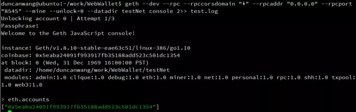

# 钱包的核心功能


钱包对外呈现可能有不同的功能，充值、提现、转账等，但从本质上来说只有一个功能，那就是转账。区块链本质上就是一个账本，记录着一笔笔交易，钱包当然离不开这个本质。

具体功能说明：

1. 充值是钱包的外部账户向钱包的地址转账；
2. 提现是钱包的账户向钱包之外的地址转账；
3. 转账功能包括钱包内地址互转和向钱包外地址转账；

在这个过程当中也对应着钱包账户资金的增加与减少。

## 用户地址如何分配

用户在使用钱包的时候肯定需要有一个属于当前账户对应在区块链上的地址，这个地址如何生成呢？不少开发人员是这样实现的：每次当用户注册时就调用 Geth 节点的personal_newAccount方法生成一个地址，并将地址存放在 Geth 节点默认的位置。这种方式可以实现，但从技术上和安全上来讲是不可取的。

性能瓶颈之一，调用 Geth 节点生成地址非常耗时，特别是当节点在处理一些同步或高消耗的工作时。
性能瓶颈之二，当 Geth 节点下的私钥越来越多，Geth 启动会变得漫长。
安全问题，Geth 节点对外要广播交易，又要保存敏感的私钥信息，安全问题巨大。

优化之后的做法是事先批量生成地址，当用户注册时只用把地址分配给用户即可。这样做的好处是：

1. 私钥的存储与 Geth 节点相隔离，确保私钥与外网的隔离性，从而确保私钥的安全；
2. 性能的保障，当用户注册时只是将数据库的数据建立了一个关联，而不用去执行费时的加密算法来生成私钥和文件。
3. 此种方法生成 Web3j 提供了相应的创建方法，可在无 Geth 节点的情况下通过代码直接生成符合私钥规则的公私钥。当然，如果有开发能力也可以通过 Geth 的源代码中的私钥生成方法抽离出一个单独的与网络无关的生产私钥程序。

##  充值交易

在比特币的钱包中，有子账户的概念，只需要在一个总账户下创建 N 多子账号，用户充值到此子账号的比特币同样的会显示在钱包上，同时又提供了查询一个地址所有交易的方法。遗憾的是以太币并没有提供此类接口，只能通过遍历区块交易的方法来判断是否有对应账户的充值交易。

相关操作：

1. 查询区块高度，比对是否是新生成的区块，eth_blockNumber；
2. 查看区块内容及详细交易，eth_gethBlockByNumber；
3. 比对交易的 toAddress 是否为本钱包的地址，如果是则记录此笔交易到数据库，并记录交易状态（pending、确认次数等）；
4. 保证入库和记账的幂等性，因为会多次查询到同一笔交易。
5. 确认次数
6. 并不是我们查询区块链中的交易就说明这边交易已经成功了，比特币是默认确认12此之后，此交易几乎不会被篡改，以太坊默认6次，那么怎么计算确认次数呢？

```
确认次数 = 当前区块高度 - 交易所在区块高度 + 1
```

此处注意事项：交易有可能会被孤立，在执行此公式时需要验证一下区块中此交易是否还是在那个区块上，是否已经被回滚。同样的，要做好幂等性保障。

## 提现交易

提现交易同样涉及到上提到的知识点，同时它又有需要额外注意的事项。
提现地址的合法性检查，可参考源代码中的校验，此合法性检查可以避免后续很多问题的出现，比如 nonce 值的维护。

交易的金额检查，nonce 值检查，特别是私钥与 Geth 节点分离之后自己来维护私钥时 nonce 值会是一个很大的问题，比如前一笔交易失败，nonce 值需要回退，此时后一笔交易已经发出，因为前一笔 nonce 没有被补齐，后一笔迟迟不会被交易。这些都需要对业务进行特殊判断和处理。

查询一个地址 nonce，eth_getTransactionCount。

## 提现与转账

提现与转账都是发起一笔交易，在以太坊的 json-rpc 中已经提到可以通过 eth_sendTransaction 和 personal_sendTransaction 直接进行转账，这是 Geth 节点所支持的。转账前可以通过 unlock 方法先将账户解锁，这些之前章节都有提到过。

但针对私钥单独存储的情况，上面的方式并不适用，可通过将交易先签名再广播的模式：

* 签名交易（可自主开发，可利用节点本身），eth_sign。
* 广播交易，可通过 eth_sendRawTransaction 进行广播。

钱包的内部转账只不过是 from 和 to 地址都是钱包的地址而已，业务层进行适当的处理。

通过这种模式，节点与外界打交道，仅有的功能就是广播交易，在此之前的所有操作都可以通过内网进行操作，极大的确保的私钥和交易的安全性。

更多功能查看官网的go-ethereum GETH钱包[RPC,API]链接（https://github.com/ethereum/go-ethereum/wiki）。


# 实现WEB WALLET钱包分配和转账功能

## 库模块介绍

创建DAPP 钱包或者PC WEB钱包，需要在Geth基础上实现功能。本章介绍2个库模块，降低钱包实现的难度。

### Hooked-web3-Provider模块

Hooked-web3-Provider模块库(https://www.npmjs.com/package/hooked-web3-provider)提供自定义程序提供方（custom provider），它使用HTTP与geth通信。这个提供方的独特之处在于，它允许使用密钥签署合约实例的sendTransation()调用，因此不再需要创建交易的数据部分了。

自定义程序提供方实际上重写了web3.eth.sendTransaction()方法的实现，所以基本上它允许签署合约实例的sendTransaction()调用以及web3.eth.sendTransation()调用。合约实例的sendTransaction()方法在内部生成交易数据，并调用web3.eth.sendTransation()广播交易。

### LightWallet模块

LightWallet是一个实现BIP32,BIP39和BIP44(https://github.com/bitcoin/bips)的HD钱包。LightWallet提供API来创建和签署交易，或者使用LightWallet生成的地址和密钥加密和解密数据。

LightWallet API被分成4个命名空间，即keystore、signing、encryption和txutils。

* signing、encrpytion和txutils分别用来提供API以签名交易，非对称的密码和创建交易
* keystore命名空间用于创建keystore、生成种子等。keystore是一个存储加密种子和密钥的对象。

> 如果使用Hooked-Web3-Provider，keystore命名空间实现交易签名者方法，该方法要求签署we3.eth.sendTransation()调用。因此keystore命名空间对于在其中发现的地址可以自动创建和签署交易。实际上，LightWallet的主要目的是成为Hooked-Web3-Provider的一个签名提供方。

可以配置密钥存储实例，来创建和签署交易或者加密和解密数据。签署交易用secp256k1参数，加密和解密用curve25519参数。

LightWallet的种子是一个12词的助记符，容易记住但不容易进行破解。它不是任意12个词，而是LightWallet生成的种子。LightWallet生成的种子在选择词和其他东西方面有特定的属性。

## 重点代码介绍

此环境代码部署在辉哥的Ubuntu虚拟机上测试成功。如果不懂如何安装Ubuntu虚拟机的，可参考《第一课 如何在WINDOWS环境下搭建以太坊开发环境》（https://www.jianshu.com/p/683ea7d62a39）完成配置。

### 代码结构分析

WebWallet钱包目录主要有以下文件和目录，各目录功能描述解释如下：

```
WebWallet
│  app.js    -管理整个应用的App对象
│  package.json -环境配置文件
├─node_modules -Nodeb.js库模块，不做修改
│
└─public
├─css
│      bootstrap.min.css -前端排版文件
│
├─html
│      index.html - 前端主页
│
└─js
     hooked-web3-provider-Formatted.min.js - 格式化可读的“hooked-web3-provider.min.js”文件，供阅读参考
     hooked-web3-provider.min.js - 实现hooked-web3-provider功能库文件
     lightwallet-Formatted.min.js  - 格式化可读的“lightwallet.min.js”文件
     lightwallet.min.js   - 实现lightwallet功能库文件
     main.js - 本案例实现主要函数
     web3.min.js -web3.js的实现文件
```
### 重点代码解读

重点实现代码在main.js文件中。

------------------------------------------------------
* generate_seed函数：调用lightwallet函数产生seed助记词，产生钱包地址。

```javascript
function generate_seed()
{
    /*产生12个单词的助记词*/
    var new_seed = lightwallet.keystore.generateRandomSeed();    
    document.getElementById("seed").value = new_seed;
    /*产生钱包地址*/
    generate_addresses(new_seed);
}
```
------------------------------------------------
* generate_addresses函数：根据助记词和需要的地址数量产生账户地址，并显示出来。

```javascript
function generate_addresses(seed) {
	if (seed == undefined) {
		/*读取输入框的助记词*/
		seed = document.getElementById("seed").value;
	}

	/*判断是否是有效的助记词*/
	if (!lightwallet.keystore.isSeedValid(seed)) {
		document.getElementById("info").innerHTML = "Please enter a valid seed";
		return;
	}

	/*需要产生多少个地址*/
	totalAddresses = prompt("How many addresses do you want to generate");

	/*获取地址数量*/
	if (!Number.isInteger(parseInt(totalAddresses))) {
		document.getElementById("info").innerHTML = "Please enter valid number of addresses";
		return;
	}

	/*随机产生密码*/
	var password = Math.random().toString();

	/*创建并显示地址，私钥和账户余额*/
	lightwallet.keystore.createVault({
		password: password,
		seedPhrase: seed
	}, function (err, ks) {
		/*以用户密码作为输出，产生的Uint8类型的数组的对称密钥，这个密钥用于加密和解密keystore*/
		ks.keyFromPassword(password, function (err, pwDerivedKey) {
			if (err) {
				document.getElementById("info").innerHTML = err;
			} else {
				/*通过seed助记词密码在keystore产生totalAddresses个地址/私钥对。这个地址/私钥对可通过ks.getAddresses()函数调用返回*/
				ks.generateNewAddress(pwDerivedKey, totalAddresses);
				var addresses = ks.getAddresses();
				/*【注意】为了能在其他PC浏览器能够访问，此处IP要改为ubuntu所在的geth环境的IP*/
				//var web3 = new Web3(new Web3.providers.HttpProvider("http://localhost:8545"));
				var web3 = new Web3(new Web3.providers.HttpProvider("http://192.168.0.106:8545"));

				var html = "";
				/*组装地址/私钥对为HTML，以便显示*/
				for (var count = 0; count < addresses.length; count++) {
					var address = addresses[count];
					/*根据地址和pwDerivedKey生成私钥*/
					var private_key = ks.exportPrivateKey(address, pwDerivedKey);
					/*获取余额*/
					var balance = web3.eth.getBalance("0x" + address);

					html = html + "<li>";
					html = html + "<p><b>Address: </b>0x" + address + "</p>";
					html = html + "<p><b>Private Key: </b>0x" + private_key + "</p>";
					html = html + "<p><b>Balance: </b>" + web3.fromWei(balance, "ether") + " ether</p>";
					html = html + "</li>";
				}

				document.getElementById("list").innerHTML = html;
			}
		});
	});
}
```

--------------------------

send_ether函数:ETH转账功能

```javascript
function send_ether() {
	var seed = document.getElementById("seed").value;

	/*seed是否有效？*/
	if (!lightwallet.keystore.isSeedValid(seed)) {
		document.getElementById("info").innerHTML = "Please enter a valid seed";
		return;
	}

	var password = Math.random().toString();

	lightwallet.keystore.createVault({
		password: password,
		seedPhrase: seed
	}, function (err, ks) {
		/*以用户密码作为输出，产生的Uint8类型的数组的对称密钥，这个密钥用于加密和解密keystore*/
		ks.keyFromPassword(password, function (err, pwDerivedKey) {
			if (err) {
				document.getElementById("info").innerHTML = err;
			} else {
				ks.generateNewAddress(pwDerivedKey, totalAddresses);

				ks.passwordProvider = function (callback) {
					callback(null, password);
				};

				/*【注意】为了能在其他PC浏览器能够访问，此处IP要改为UBUNTU所在的GETH环境的IP*/
				/*新建HookedWeb3Provider, 参考https://www.npmjs.com/package/hooked-web3-provider*/
				/**
				var provider = new HookedWeb3Provider({                    host: "http://localhost:8545",
				transaction_signer: ks*/
				var provider = new HookedWeb3Provider({
						host: "http://192.168.1.135:8545",
						transaction_signer: ks
					});

				/*以HookedWeb3Provider为对象产生web3，
				不同于宠物商店案例的new Web3.providers.HttpProvider('http://localhost:8545');*/
				var web3 = new Web3(provider);

				var from = document.getElementById("address1").value;
				var to = document.getElementById("address2").value;
				var value = web3.toWei(document.getElementById("ether").value, "ether");

				/*从源地址钱包向目标地址钱包发送value的以太币*/
				web3.eth.sendTransaction({
					from: from,
					to: to,
					value: value,
					gas: 21000
				}, function (error, result) {
					if (error) {
						document.getElementById("info").innerHTML = error;
					} else {
						document.getElementById("info").innerHTML = "Txn hash: " + result;
					}
				})
			}
		});
	});
}
```

-------------------------------

## WEB WALLET钱包功能测试

因为辉哥在本地配置的Ubuntu虚拟机屏幕比较小，采用使用Xshell 4进行SSH远程登录的方式，采用本地windows chrome浏览器的方式进行演示的方式。各位看官也可以直接在Ubuntu上操作的方式完成。

Ubuntu机器的ip地址为“192.168.1.135”，相关的main.js的2处IP地址也改为了“192.168.1.135”，并更新部署到Ubuntu工作目录下。

###  启动GETH开发实例

启动Ubuntu远程连接后，窗口输入命令用于运行GETH环境。

```bash
geth --dev --rpc --rpccorsdomain "*" --rpcaddr "0.0.0.0" --rpcport "8545" --mine --unlock=0 --datadir testNet console 2>> test.log
```

针对GETH的命令参数稍作解释，具体参考文章《第五课 以太坊客户端Geth命令用法-参数详解》。（https://www.jianshu.com/p/c0b62ce0aa44）

说明：

--dev 表示启动开发环境；
--rpc 表示启用HTTP-RPC服务器；
--rpccorsdomain "" 表示用于允许一些特定域与geth通信。通配符表示可与任何域名通信。
--rpcaddr "0.0.0.0"  表示geth服务器可以到达哪个IP地址。默认的是127.0.0.1。将它的值改为0.0.0.0,这表示该服务器可以使用任何IP地址到达。
--rpcport "8545"  表示HTTP-RPC服务器监听端口(默认值:8545)
--mine 表示打开挖矿
--unlock=0 表示解锁账号0，geth默认创建的账户，命令启动后系统提示“Passphrase:”回车输入密码为空后即可解锁账号0。

运行成功后，输入“eth.accounts”可以看到geth自动创建的一个默认账户地址为“0x5eaba24091f993917fb35188add523c501dc1354”。



### 启动APP服务

在XShell 4新开一个窗口链接，进入到辉哥工程目录~/work/WebWallet，然后启动本APP。

node app.js

操作截图如下：

.webp)

### Web Wallet基本功能操作

1. 打开WEB钱包网址


.webp)

2. 点击"Generate New Seed"产生种子

点击"Generate New Seed"按钮，输入需要产生子账户地址个数，例如2个

.webp)

3. 界面上显示产生的助记词seed和对应的账户信息：

.webp)

记录下相关信息：

SEED:obtain warm allow bicycle mushroom fiber shell tower twenty corn cherry close
Address1: 0xe45d865ed260fdf2409f66d4a9499a664943079c
Address2: 0x09da12a3c1e0675c29e14967a3be765b008205e4

4. 给目标地址发送ETH

回到geth环境，从系统账户account[0]给目标账户地址打100个ETH。

```bash
eth.sendTransaction({from: '0x5eaba24091f993917fb35188add523c501dc1354', to: '0xe45d865ed260fdf2409f66d4a9499a664943079c', value: web3.toWei(100, "ether")})
```

操作截图如下：

.webp)

5. 查看目标地址信息

点击主页的"Generate Details"按钮，可以刷新账户信息。LightWallet库函数中，只要是相同的seed，产生的账户地址是相同的。

点击查看，可以发现目标账户地址"0xe45d865ed260fdf2409f66d4a9499a664943079c"收到了100个ETH。

.webp)

6. 钱包内账户转账

目标：
从第一个账户地址“0xe45d865ed260fdf2409f66d4a9499a664943079c”转发9个ETH到第二个账户地址“0x09da12a3c1e0675c29e14967a3be765b008205e4”

.webp)


## 参考文献

1,ethereumjs-tx
https://www.npmjs.com/package/ethereumjs-tx
Github代码：
https://github.com/ethereumjs/ethereumjs-tx

2，hooked-web3-provider
https://www.npmjs.com/package/hooked-web3-provider
Github代码：
https://github.com/consensys/hooked-web3-provider

3，web端钱包源码
1）eth web: https://github.com/ConsenSys/eth-lightwallet
2).android: https://github.com/walleth/walleth
3).IOS:     https://github.com/ethers-io/EthersWallet-ios

4，WEB3.JS完整文档
https://github.com/ethereum/wiki/wiki/JavaScript-API
WEB3.JS代码
https://github.com/ethereum/web3.js

5,go-ethereum GETH钱包[RPC,API]
https://github.com/ethereum/go-ethereum/wiki

6，以太坊钱包的开发
https://blog.csdn.net/u011494083/article/details/79654872
https://blog.csdn.net/u011494083/article/details/79655830
https://github.com/ethereum/wiki/wiki/JavaScript-API#web3ethgettransactioncount

7，第08课：开发以太坊钱包的基本思路与安全[中心化钱包和去中心化钱包讲的不错]
https://blog.csdn.net/su_bo_2010/article/details/80419483

8,以太坊客户端Ethereum Wallet与Geth区别简介
https://blog.csdn.net/wuxianbing2012/article/details/79777921

9，[以太坊源代码分析] V. 从钱包到客户端
https://blog.csdn.net/teaspring/article/details/78350888

10，【区块链开发】从零构建基于以太坊（Ethereum）钱包Parity联盟链
https://ke.qq.com/course/254661

11，基于以太坊的电子钱包开发分析
https://mp.weixin.qq.com/s/YQNlYozCvDGxyACliKDsgA

12，《区块链项目开发指南》- Narayan Prusty[India]

13，BIP32,BIP39协议-关于HD钱包和助记种子规范
https://github.com/bitcoin/bips

14,格式化JS工具
http://tool.oschina.net/codeformat/js

15，第03课：以太坊常见 JSON-RPC 接口解析
https://blog.csdn.net/su_bo_2010/article/details/80095187