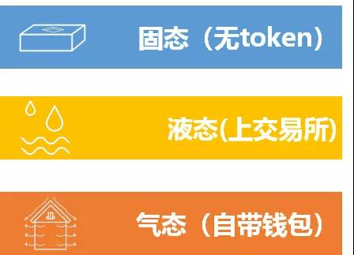

# 钱包

> 钱包：EOS和ETH的钱包的表现形式并不相同，

钱包对外呈现可能有不同的功能，充值、提现、转账等，但从本质上来说只有一个功能，那就是转账。区块链本质上就是一个账本，记录着一笔笔交易，钱包当然离不开这个本质。

具体功能说明：

* 充值是钱包的外部账户向钱包的地址转账；
* 提现是钱包的账户向钱包之外的地址转账；
* 转账功能包括钱包内地址互转和向钱包外地址转账；

在这个过程当中也对应着钱包账户资金的增加与减少。

## 按照钱包区分dapp

1. 当生态中没有TOKEN经济时，这个平台是固态的，谁是用户，谁是利益平台最终受益方，是静态固化的。这是通用的+互联网模式，海量的用户制造了BATJ等独角兽企业，但他们永远只是贡献者，自身没有从中分享更多的利益。

2. 当生态中包含TOKEN，然后通过上交易所完成利益变换时，我认为这时的生态是液态的。生态中的利益兑换可以通过交易所进行转换。但是这样无法去中心化，无法去中介化，存在着不便捷和被收费的问题。这种模式下，无法形成通证经济的自循环生态。同时由于交易所的资产安全，被攻击，对现实金融生态的影响等原因，是很多国家明令禁止的。

3. 当生态中除了TOKEN，还自带钱包后，我认为这个区块链生态才过渡到气态。在气态下，通证和资产的兑换是无处不在，非常方便的。认同这个平台的管理方和用户方自成循环体系，高效的促进了生态内的资产流通。

## 三种钱包

### Ethereum Wallet

Ethereum Wallet 又叫做mist客户端，是mist项目的钱包。

### Geth

Geth 是go-ethereum项目的客户端，也是目前使用最为广泛的客户端。

> Ethereum Wallet与Geth的不同之处在于：
> 1. 前者不能通过API来调用以太坊的接口，后者可以通过对接API（目前交易平台常常使用的方式），或直接通过命令行进行操作。
> 2. 前者有可视化的界面，后者没有

### DAPP自带钱包

DAPP自带钱包是在Geth基础上开发出来的移动端 App或者网页版钱包，例如彩贝APP账号自带的ColorBay通证转账功能的钱包。这个钱包依附于彩贝APP，不能独立存在。

## 中心化钱包和非中心化钱包

根据私钥存储的位置可分为两类：

1. 中心化私钥存储的钱包，比如火币的钱包；
2. 去中心化钱包，私钥存储在用户端，比如 imtoken 钱包，彩贝钱包。

> 无论是中心化的钱包或去中心化的钱包，在 App 层面都是很轻量级的，App 内是不会内置一个 Geth 节点，交易的查询或发送都是通过服务器来进行操作，不同点是交易签名的私钥由谁来保管和负责。

## ETH

## EOS
> EOS对于账户的设计与ETH有很大的不同，引入了Account账户, Wallet钱包, 钱包密码, Key公私钥, Permission权限等众多概念

### 钱包和账户

左边是EOS Account账户，可以把它看成是一个保险箱，里面有EOS Token以及智能合约，而需要转移里面的EOS Token（或者执行智能合约），你需要钱包中对应的私钥来解锁这个保险箱。

如图所示，右边是EOS Wallet钱包，里面只存放私钥，而且钱包有一个密码，需要输入密码才能解锁钱包，读取私钥。

### 不同权限

* owner权限是账户的最高权限，可以修改其它权限。
* active权限默认可以进行转账等操作，但不能修改权限。

EOS Dawn 3.0测试版本中创建一个账户的命令是：

cleos create account {创建者账户名} {新的账户名} 公钥1 公钥2

其中

* {创建者账户名}是为这个创建动作支付EOS的账户
* {新的账户名}是你要创建的帐户名
* 公钥1和公钥2分别是两个不同权限的密钥对的公钥。

所以把权限系统加上，图就变成上面这个样子，一个保险柜有两个开关，不过打开后可以进行操作的权限是不同的。2个私钥可以存在一个钱包里，也可以如上图所示存在不同的钱包里（由不同的人控制）。

### 账户名
每个保险箱有一个名字，就是EOS账户名。与以太坊不同，EOS的账户名不再是一串很长很长的地址，而是一个你可以自定义的英文字母+数字(12345)+符号(.)，最长12位，最短1位，全局唯一，先到先得

转账和智能合约等操作的执行都是在Account这个保险箱进行，所以账户名在EOS世界其实是以太坊的地址。