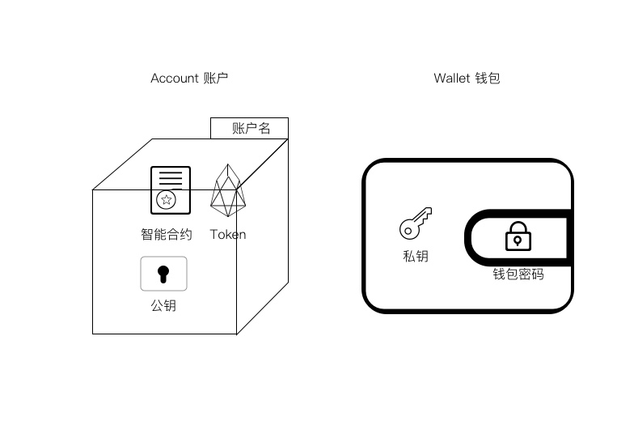
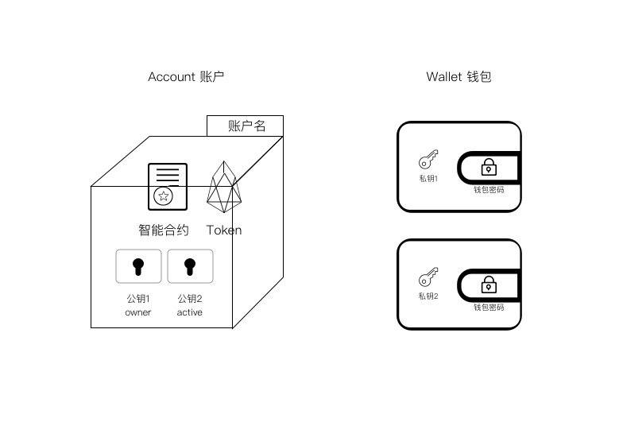

# 钱包

> 钱包：EOS和ETH的钱包的表现形式并不相同，

## ETH

## EOS
> EOS对于账户的设计与ETH有很大的不同，引入了Account账户, Wallet钱包, 钱包密码, Key公私钥, Permission权限等众多概念

### 钱包和账户

左边是EOS Account账户，可以把它看成是一个保险箱，里面有EOS Token以及智能合约，而需要转移里面的EOS Token（或者执行智能合约），你需要钱包中对应的私钥来解锁这个保险箱。

如图所示，右边是EOS Wallet钱包，里面只存放私钥，而且钱包有一个密码，需要输入密码才能解锁钱包，读取私钥。

### 不同权限

* owner权限是账户的最高权限，可以修改其它权限。
* active权限默认可以进行转账等操作，但不能修改权限。

EOS Dawn 3.0测试版本中创建一个账户的命令是：

cleos create account {创建者账户名} {新的账户名} 公钥1 公钥2

其中

* {创建者账户名}是为这个创建动作支付EOS的账户
* {新的账户名}是你要创建的帐户名
* 公钥1和公钥2分别是两个不同权限的密钥对的公钥。

所以把权限系统加上，图就变成上面这个样子，一个保险柜有两个开关，不过打开后可以进行操作的权限是不同的。2个私钥可以存在一个钱包里，也可以如上图所示存在不同的钱包里（由不同的人控制）。

### 账户名
每个保险箱有一个名字，就是EOS账户名。与以太坊不同，EOS的账户名不再是一串很长很长的地址，而是一个你可以自定义的英文字母+数字(12345)+符号(.)，最长12位，最短1位，全局唯一，先到先得

转账和智能合约等操作的执行都是在Account这个保险箱进行，所以账户名在EOS世界其实是以太坊的地址。